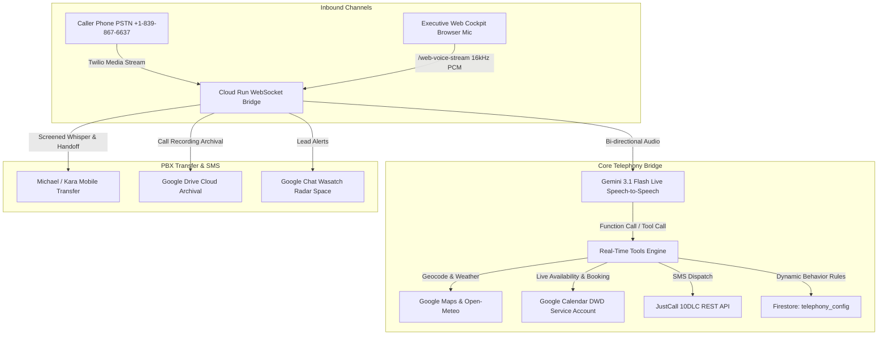

# RHIVE Telephony Swarm & Web Voice Bridge

An enterprise-grade, real-time telephony and voice AI orchestration engine powering **RHIVE Construction** along the Wasatch Front in Utah. Built on **Google Gemini 3.1 Flash Live**, **GCP Cloud Run**, **Firestore**, and **Twilio Voice Media Streams**.

---

## Key Features

1. **Native Gemini 3.1 Flash Live Speech-to-Speech Engine:**
   - Ultra-low latency (<250ms turn-taking) bi-directional audio streaming over WebSockets.
   - Generates direct 24kHz linear PCM audio tokens—eliminating robotic Text-to-Speech readers.
   - Acoustic prosody modeling: audible vocal smile, natural micro-breaths, deliberate pauses via ellipses (`...`) and em-dashes (`—`), and situational emotion calibration.

2. **In-Browser Web Voice Testing Cockpit ($0 Twilio Carrier Overhead):**
   - Direct digital audio link via Web Audio API (`AudioContext`, `ScriptProcessorNode` 16kHz PCM capture / 24kHz playback).
   - Allows Michael Robinson and Kara Robinson to stress-test objection handling, pricing defense, and prompts directly in their browser without burning Twilio PSTN minutes.
   - Real-time streaming conversation turns with per-turn latency meters and vocal smile indicators.

3. **Dynamic Prompt Tuning & Hot-Reload Engine:**
   - Inspects conversation turns and extracts structured behavioral rules using Gemini 2.5 Flash / 3.1 Pro.
   - 1-click approval directly writes to Firestore (`telephony_config/active_instructions`).
   - Automatically hot-reloads into Honey's dynamic system prompt on the very next phone or web call—**zero Cloud Run redeployments required**.

4. **Google Identity Auth Gate:**
   - Protects the internal control panel and telephony tools behind authorized Google Sign-In.
   - Whitelist enforced: `michael@rhiveconstruction.com`, `mjrob14@gmail.com`, `kara@rhiveconstruction.com`.

5. **Screened Warm PBX Handoff & Specialist Whisper:**
   - Multi-channel call routing with Option 1-4 custom hold music loops (Aoede Lyria 3.5 audio suite).
   - Dynamic intent capture (Turn 1 full disclosure exemption: never re-asks for caller name, company, or invoice).
   - Screened whisper briefing Michael or Kara before bridge connection.
   - Dual DTMF + Speech recognition on transfer answer.

6. **Domain-Specific Tool Suite:**
   - `verify_address`: Google Maps geocoding + Wasatch Front polygon check + real-time Open-Meteo storm radar.
   - `get_available_windows`: Live Google Calendar DWD free/busy availability check for Michael.
   - `book_inspection`: High-status calendar booking with RFC-5545 calendar invitations.
   - `update_caller_profile`: Cross-turn and cross-hop identity persistence.
   - `transfer_to_specialist`: Warm PBX handoff.
   - `hangup_call`: Firm termination of cold solicitors and spam.

---

## Architecture Diagram



---

## Quick Start (Local Development)

1. **Clone the Repository:**
   ```bash
   git clone https://github.com/RHIVE-Construction/RHIVE-Telephony.git
   cd RHIVE-Telephony
   ```

2. **Install Dependencies:**
   ```bash
   npm install
   ```

3. **Configure Environment:**
   ```bash
   cp .env.example .env
   # Edit .env with your Gemini API key and credentials
   ```

4. **Start the Server:**
   ```bash
   npm start
   ```
   Navigate to `http://localhost:8080/settings` to access the control panel and Web Voice Cockpit.

---

## Production Deployment (GCP Cloud Run)

Deploy directly using Google Cloud SDK:

```bash
gcloud run deploy rhive-voice-live-bridge \
  --source=. \
  --project=rhive-quantum-quoter \
  --region=us-central1 \
  --allow-unauthenticated \
  --timeout=3600 \
  --concurrency=80 \
  --min-instances=1 \
  --max-instances=25 \
  --cpu=1 \
  --memory=1Gi \
  --no-cpu-throttling
```

---

## Security & Compliance
- **Zero Raw Secrets:** All credentials, service accounts, and API tokens are loaded exclusively via environment variables or GCP Secret Manager.
- **Soft Delete Discipline:** All CRM and call log state modifications adhere to soft deletion (`isDeleted: true`).
- **Google Auth Gate:** Internal telephony dashboards require verified Google tokens matching authorized executive emails.
