# R-hive Construction Roofing Specialists: Master Customer Telephony Flowchart & Script Matrix (Revision 66)
**System Target Line:** +1 (839) 867-6637 (`839-86-ROOFS`) *(All calls to RHIVE Main are forwarded here for Honey to answer directly)*  
**Engine:** Google Gemini 3.8 Live Multimodal Speech-to-Speech (`gemini-3.8-live` & `gemini-3.8-live-extended-thinking`)  
**Acoustic Profile:** Leda (Honey AI Roofing Specialist & Executive Project Specialist) | **Tone:** High warmth, happy, buoyant vocal smile  
**Architecture:** Zero-IVR Ring 1 Direct Answer (Pure Voice, Zero Robotic Menus)  

---

## 1. High-Resolution Zoomable Customer Decision Architecture

> [!TIP]
> **Zoomable High-Resolution Visual Flowchart:** Below is the master visual infographic. Click or zoom in for high-definition clarity.

```mermaid
flowchart TD
    Dial["Caller Dials Office Line / Forwarded from Main"] --> Ring1["Honey Ring-1 Direct Answer (Zero IVR Menus / Pure Voice)<br/>150ms Settle Delay + Buoyant Vocal Smile<br/>'Hello, this is Honey! R-hive's AI Roofing Specialist, how may I assist with your roofing project today!?'"]

    %% Direct Address & Intent Flow
    Ring1 --> AddrCapture1["Customer States Reason & Property Address"]
    AddrCapture1 --> ToolProp1["TOOL: verify_address<br/>OpenStreetMap Geocoding + Utah County Parcel ($0.00) + Open-Meteo County Weather"]
    
    ToolProp1 --> AddrConfirm{"Mandatory Audio Verification Gate:<br/>Honey reads back: 'I have [Address], [City], Utah [Zip]—does that match your property?'<br/>Honey PAUSES & WAITS for verbal confirmation"}
    
    AddrConfirm -->|No / Corrected| FixAddr["Caller Corrects Number or Street -> Re-run verify_address"]
    FixAddr --> ToolProp1
    AddrConfirm -->|Yes / Confirmed| PropNameUpdate["Derive & Adopt propertyName:<br/>e.g., 'the 9917 South property' or 'the 10437 Shady Plum property'<br/>Honey: 'I have your property details right here on my phone.'"]

    %% Intent Qualification with Shorthand
    PropNameUpdate --> Q_Intent{"Honey Qualifies Intent (Adopting Shorthand):<br/>'Perfect! For the [propertyName], are you looking for a certified quote on an aging roof,<br/>is this for storm damage, leaks, and emergency tarping, or commercial and multi-property projects?'"}

    %% Case 1: Residential Replacement (Core Business Model - Remote Aerial + 15-Min Video Option)
    Q_Intent -->|Case 1: New Customers & Certified Quotes| RemoteAerial["Core Model: Remote Aerial Measurement & 15-Min Video Call<br/>Honey: 'We measure your roof via precision aerial engineering to deliver<br/>a certified quote without interrupting your day with a truck roll.'"]
    RemoteAerial --> VideoCallOption{"Visible from Ground?<br/>Offer 15-Minute Remote Phone Video Call"}
    VideoCallOption -->|Homeowner Walks Outside| VideoSlot["Schedule 15-Minute Remote Video Call Inspection<br/>Specialist inspects live from ground via smartphone video"]
    VideoCallOption -->|Aerial Scan Preferred| MeasureCall["MeasureCall Ping-Pong Sequence (1 Question / Turn):<br/>1. Structure changes & Solar detach warranty?<br/>2. Skylights, swamp cooler & satellite removals?<br/>3. Layer count (slope-aware)?<br/>4. Slat board decking & eave ventilation?<br/>5. Gutters & winter ice dam areas?<br/>6. DISC psychometrics & timeline?"]
    VideoSlot --> CloseProtocol
    MeasureCall --> CloseProtocol

    %% Case 2: Commercial & Multi-Property Management
    Q_Intent -->|Case 2: Commercial & Multi-Property Projects| CommercialPath["Commercial roofs & multi-property portfolios require on-site evaluations for core cuts & parapets<br/>TOOL: get_available_windows (Michael & Kara Calendar)"]
    CommercialPath --> PresentSlots

    %% Case 3: Storm Damage, Leaks & Emergency Tarping
    Q_Intent -->|Case 3: Storm Damage, Leaks & Emergency Tarping| LeakCheck{"Active Leak / Dripping Inside Now?"}
    LeakCheck -->|Yes| ActiveTarp["Emergency Leak Tarping ($150+ Credited Fee)<br/>Honey checks County & City Weather Urgency:<br/>'It looks like there is an [X]% chance of rain in [County] moving into [City]...'"]
    ActiveTarp --> CloseProtocol

    LeakCheck -->|No / Storm Insurance Claim| InsurancePath["Forensic storm damage scope documentation for adjuster (UPPA Compliant)<br/>TOOL: get_available_windows"]
    InsurancePath --> PresentSlots

    %% Case 4: Roof Repairs (Clear Photos vs 15-Min Video Call vs On-Site)
    Q_Intent -->|Case 4: Roof Repairs| RepairAge{"Is roof older or younger than 15 years?"}
    RepairAge -->|Older than 15 Years| OlderRoof["Brittle Shingles: Spot repairs do not hold<br/>Qualify for certified replacement + repair quote<br/>TOOL: get_available_windows"]
    OlderRoof --> PresentSlots
    RepairAge -->|Younger than 15 Years| RepairTriage{"Has visible exterior photos or inside drywall?"}
    RepairTriage -->|Exterior Photos| SendPhotoSMS["Text clear exterior photos back to specialist<br/>Reviewed within 24 hours"]
    SendPhotoSMS --> CloseProtocol
    RepairTriage -->|No Photos / Cannot Access| VideoOrOnSite["Offer 15-Minute Remote Video Call from Ground<br/>or On-Site Inspection"]
    VideoOrOnSite --> PresentSlots

    %% Calendar Booking Branch
    PresentSlots["Honey Presents Tight 3-Hour Arrival Cushion"]
    PresentSlots --> SlotConfirm["Customer Confirms Arrival Window"]
    SlotConfirm --> BookCal["TOOL: book_inspection<br/>Inserts into 'RHIVE Project Inspections' Google Calendar<br/>SMS to Michael, Kara & Customer | Chat Webhook"]
    BookCal --> CloseProtocol

    %% Branch: Operations, Trade Suppliers & Permitting (Flow 3)
    Ring1 -->|Trade Partner / Supplier / Inspector| TradePath["Trade / Supplier / Inspector Identification<br/>TOOL: transfer_to_specialist (target: kara)"]
    TradePath --> KaraWhisper["Kara Warm Whisper Handoff (+150ms settle pause)"]

    %% Branch: Cold Solicitors & Spammers (Flow 4)
    Ring1 -->|Cold Pitch / Marketing / Spammer| SpamPath["Anti-Spam Quarantine Policy Triggered<br/>16-Word Pruned Prompt Redirect to info@rhiveconstruction.com"]
    SpamPath --> GracefulDrop["Event-Driven Speech Buffer Disconnect<br/>Wait turnComplete + 1500ms audio drain -> terminate carrier"]

    %% Mandatory 4-Step Close Sequence
    CloseProtocol["Mandatory Closing Sequence:<br/>Wait 600ms -> say 'Goodbye!' -> wait 150ms -> terminate line cleanly"]
```



    CloseProtocol --> Step1["Step 1: Express Authentic Gratitude (with Vocal Smile)"]
    Step1 --> Step2["Step 2: Communication Channel & Contact Confirmation"]
    Step2 --> Step3["Step 3: Secondary Assistance Check ('Is there anything else I can check?')"]
    Step3 --> Step4{"Caller Finished?"}
    Step4 -->|Has More Questions| AnswerConcise["Honey Answers Concisely & Warmly (<18 words)"]
    AnswerConcise --> Step3
    Step4 -->|Says Bye / Silence 10s| TerminateCall["Honey: 'You are so welcome! Have a wonderful day!'<br/>TOOL: hangup_call"]
```

---

## 2. Spoken Scripts by Turn & Flow

### Turn 1: Honey's Canonical Opening Greeting (Ring 1 Direct Answer)
* **Trigger:** Customer dials `+1 (839) 867-6637`. Zero robotic menus, zero DTMF options.
* **Honey Speech (<20 Words):**
  > *"Hello, this is Honey! R-hive Construction's AI Roofing Specialist, how may I assist your call today!?"*

---

### Turn 2: Address Capture & Mandatory Audio Confirmation Gate
* **Caller:** *"Hi, I'm calling to get a roof replacement quote for 9917 South 3200 West in South Jordan."*
* **Honey Action:** Calls `verify_address({"address": "9917 S 3200 W, South Jordan, UT"})`.
* **Honey Speech (<20 Words):**
  > *"Hi Tom! I have 9917 3200 West, South Jordan, Utah 84095—does that match your property?"*
* **Rule:** Honey **MUST** stop, read back the address, and wait for verbal confirmation before moving on.

---

### Turn 3: Confirmation & Dynamic Shorthand Adoption
* **Caller:** *"Yes, that is correct."*
* **System Action:** Generates `propertyName = "the 9917 South property"`.
* **Honey Speech (<25 Words):**
  > *"Perfect! For the 9917 South property, are you looking to replace an aging roof, is this for storm or insurance damage, an active leak, or a commercial building?"*
* **Rule:** Honey adopts `"the [propertyName]"` immediately on the very next turn and references it throughout the call.

---

### Turn 4-7: MeasureCall 4-Question Sequence (Flow 1 Quotes)
1. **Solar Panels:** *"Got it on the aging roof! Do you have solar panels installed on the roof?"*
2. **Structural Changes:** *"Have there been any recent additions or structural roof changes since last year?"*
3. **Layers / Dormers:** *"Is this the original single layer of shingles, or has it ever been roofed over?"*
4. **Soffit Ventilation (Decade Built):** *"Looking at county records, the home was built in the 1990s—under your roof eaves outside, do you happen to have those little perforated vent panels, or is it solid wood under there?"*

---

### Turn 8: 4-Step Closing Protocol, Natural Speech Sign-Off & Audio Buffer Flush
1. **Recap Accomplishment:** *"To recap, we have your certified roof quote locked in for the 9917 South property."*
2. **Explain Next Steps:** *"Your project specialist will review the satellite measurements and text your cell within 24 business hours."*
3. **Check Additional Assistance:** *"Do you have any other questions I can assist with today?"*
4. **Caller Clearance:** Caller: *"Nope, that's all! Thank you!"*
5. **Natural Voice Termination Doublet:**
   Honey:
   > *"Have a great day! Goodbye!"*
   *(or: "Thank you for calling R-hive Construction Roofing Specialists! Have a great day! Goodbye!")*
6. **Execution & Audio Buffer Flush:**
   - Honey invokes `hangup_call`.
   - **Carrier Buffer Cushion:** A strict 1200ms audio buffer flush cushion runs before `ws.close(1000)` executes, guaranteeing that the carrier RTP buffer drains completely through the caller's mobile handset with zero syllable clipping on "-bye!".

---

### 🔬 Natural AI Voice Call Termination Research (Conversational Analysis & FAANG Voice Standards)

Industry empirical research (Schegloff & Sacks telephone conversational analysis, OpenAI Realtime, Retell, and Google DeepMind speech synthesis standards) outlines why voice agents frequently fail at natural call termination and how Honey solves it:

1. **The Pre-Closing Doublet Requirement:**
   - In human conversation analysis, telephone calls cannot be abruptly severed upon task completion without generating cognitive dissonance.
   - Humans require a **pre-closing exchange** (Step 3: checking for unaddressed topics) followed by a **terminal exchange** (Step 5: mutual farewell).
   - If an AI merely says *"Have a great day!"* without an explicit terminal sign-off token (*"Goodbye!"*), human callers pause in confusion, expecting another turn or asking *"Are you still there?"*. 
   - Conversely, saying only *"Goodbye"* without a well-wish sounds cold, dismissive, or robotic.
   - **Solution:** Honey uses the compound terminal sequence: **Warm Wish + Terminal Closure Marker** (*"Have a great day! Goodbye!"*), which conclusively signals to human acoustic psychology that the conversation is complete.

2. **Terminal Falling Pitch Contour (Prosodic Completion):**
   - Natural speech models must terminate with a pronounced falling fundamental frequency ($F_0$) contour on the final syllable of *"Goodbye!"*. 
   - A rising pitch ($F_0 \uparrow$) signals an open question or continuation, causing callers to stay on the line. 
   - Honey's punctuation engineering (`!`) prompts Gemini Live's acoustic decoder to synthesize a clean, falling, conclusive cadence.

3. **Carrier Transit Latency & RTP Jitter Buffer Drain:**
   - Telephony calls run over RTP UDP streams transiting carrier SBCs (Session Border Controllers), cellular base stations, and handset jitter buffers (accumulating 200ms–500ms of transit latency).
   - If a backend server issues a Twilio `<Hangup/>` or tears down the WebSocket immediately after the last audio frame is generated, the network socket closes while the final syllables are still in transit, chopping off the trailing audio (`"Goodb—[click]"`).
   - **Solution:** Honey enforces a mandatory **1200ms carrier audio flush timer** (`setTimeout(..., 1200)`) in `hangup_call`. The audio stream plays through to silence before the carrier connection terminates gracefully.

---

## 3. Master Telephony Swarm Cross-Flow Artifact Links

| Swarm Node | Scope & Function | Document Link |
| :--- | :--- | :--- |
| **Flow 1** | Residential & Commercial Certified Quotes, Repairs & Maintenance | [flow_quotes_residential_commercial.md](file:///C:/Users/mjrob/.gemini/antigravity/brain/0ea1d186-c0b7-4d42-8bc0-3cea6c384d14/flow_quotes_residential_commercial.md) |
| **Flow 2** | Emergency Active Leak Tarping ($150+ Credited) & Insurance Restoration | [flow_emergency_leaks_insurance_storm.md](file:///C:/Users/mjrob/.gemini/antigravity/brain/0ea1d186-c0b7-4d42-8bc0-3cea6c384d14/flow_emergency_leaks_insurance_storm.md) |
| **Flow 3** | Trade Partners, Material Suppliers, Municipal Permitting & Compliance | [flow_trade_suppliers_permitting_compliance.md](file:///C:/Users/mjrob/.gemini/antigravity/brain/0ea1d186-c0b7-4d42-8bc0-3cea6c384d14/flow_trade_suppliers_permitting_compliance.md) |
| **Flow 4** | Cold Solicitor & Unsolicited Marketing Anti-Spam Perimeter Quarantine | [flow_anti_spam_quarantine.md](file:///C:/Users/mjrob/.gemini/antigravity/brain/0ea1d186-c0b7-4d42-8bc0-3cea6c384d14/flow_anti_spam_quarantine.md) |
| **Master Spec** | Complete Master Telephony System Specifications & Swarm Architecture | [master_telephony_workflow_specification.md](file:///C:/Users/mjrob/.gemini/antigravity/brain/0ea1d186-c0b7-4d42-8bc0-3cea6c384d14/master_telephony_workflow_specification.md) |
| **Live Bridge** | Production GCP Cloud Run Speech-to-Speech WebSocket Implementation | [server.js](file:///c:/Users/mjrob/OneDrive/Desktop/App%20Repo%20s/MJR_EPA/services/telephony-live-bridge/server.js) |
| **A2A Results** | Overnight Agent-to-Agent Simulation Test Suite & Performance Log | [rev60_a2a_simulation_results.json](file:///C:/Users/mjrob/.gemini/antigravity/brain/0ea1d186-c0b7-4d42-8bc0-3cea6c384d14/rev60_a2a_simulation_results.json) |
