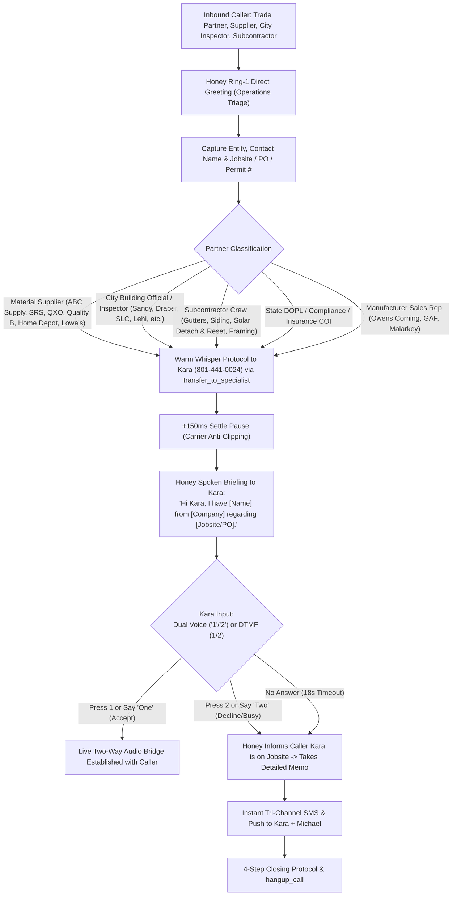

# 🤝 Flow 3: Trade Partners, Suppliers, Permitting & Compliance
**System OS:** ANTIGRAVITY V8.0  
**Swarm Revision:** Revision 60 Production Release  
**Target Environment:** Google Cloud Run (`rhive-voice-live-bridge`)  
**Live Telephony Endpoint:** `+1 (839) 867-6637` (+1 839-86-ROOFS)  
**Assigned Swarm Role:** Honey (AI Executive Switchboard) & Kara (RHIVE VP of Operations & Project Coordination)  

---

## 1. Executive Workflow Scope & Operating Model

This pathway governs all operational, supply chain, municipal, and trade partner communications. Calls on this flow bypass retail sales triage and connect directly to Operations (Kara) via our low-latency **Warm Whisper Handoff Protocol** or execute `transfer_to_specialist({"targetSpecialist": "kara"})`. Zero IVR menu is used; Honey immediately identifies the commercial entity on Ring 1.



---

## 2. Core Operational Invariants & Entity Architecture

### A. Recognized Trade & Institutional Entities
1. **Material Supply Houses:**
   * **ABC Supply Co.** (Murray, Salt Lake City, Orem)
   * **SRS Distribution / Sunbelt Supplies** (Salt Lake City, West Valley)
   * **QXO** (formerly Bradco Supply / Building Products)
   * **Quality Building Products (Quality B)**
   * **Home Depot Pro Desk & Lowe's Commercial Pro**
2. **Municipal Permitting & Building Inspection Departments:**
   * Sandy City Community Development & Building Division
   * Draper City Building Department
   * Salt Lake City Building Services & Permitting
   * South Jordan Building & Safety Division
   * Lehi, West Jordan, Murray, and Utah County jurisdictions
3. **Specialty Trade Subcontractors:**
   * 5" & 6" Continuous Seamless Gutter & Downspout crews
   * Solar Detach & Reset engineering technicians
   * Soffit, Fascia, and Architectural Siding crews
   * Structural Framing & Decking replacement teams
4. **Regulatory & Compliance Entities:**
   * **Utah DOPL** (Division of Occupational and Professional Licensing)
   * General Contractor Insurance COI (Certificates of Insurance) coordinators
   * Worker's Compensation Fund (WCF) & safety compliance officers
5. **Manufacturer Territory Managers:**
   * Owens Corning Roofing Specialists & Area Sales Managers
   * GAF Commercial & Residential Territory Managers

---

## 3. Kara Warm Whisper Protocol Specification

When an operational caller is identified, Honey executes `transfer_to_specialist({"targetSpecialist": "kara", "reason": "material_delivery"})` to perform an outbound whisper leg to Kara's direct line while maintaining soft branded hold audio on the caller leg.

### A. The Acoustic Handshake & Settle Pause
* **Carrier Audio Clipping Defense:** Many mobile carriers (Verizon, AT&T, T-Mobile) truncate the initial 100ms–250ms of audio when a cell phone answers.
* **Invariant:** Honey injects a mandatory **+150ms settle pause** (`<break time="150ms"/>`) before speaking the whisper payload.
* **Carrier PBX Greeting Bypass:** The bridge automatically filters out carrier ringing, JustCall forwarding messages ("Connecting your call..."), and voicemail prompts before triggering whisper playback.

### B. Spoken Whisper Script Template
```text
<speak>
  <break time="150ms"/>
  Hi Kara, Honey here. I have [Contact Name] from [Organization] on the line regarding [Jobsite Address / PO / Permit Number].
  Press 1 or say "connect" to take this call. Press 2 or say "voicemail" to send to priority memo.
</speak>
```

### C. Fallback & Priority Dispatch Protocol
* If Kara declines or does not answer within 18 seconds (4 rings):
  1. Honey instantly returns to the caller:
     > *"Kara is currently coordinating on an active jobsite. I can take down your specific update or invoice number and flag her immediately for a priority callback within thirty minutes. What would you like me to pass along?"*
  2. Honey captures caller notes and mobile callback number.
  3. Dispatches immediate tri-channel notification via Twilio/JustCall SMS and Webhook to Kara's mobile and Michael's phone.

---

## 4. Master Telephony Swarm Cross-Flow Artifact Links

| Swarm Node | Scope & Function | Document Link |
| :--- | :--- | :--- |
| **Flow 1** | Residential & Commercial Certified Quotes, Repairs & Maintenance | [flow_quotes_residential_commercial.md](file:///C:/Users/mjrob/.gemini/antigravity/brain/0ea1d186-c0b7-4d42-8bc0-3cea6c384d14/flow_quotes_residential_commercial.md) |
| **Flow 2** | Emergency Active Leak Tarping ($150+ Credited) & Insurance Restoration | [flow_emergency_leaks_insurance_storm.md](file:///C:/Users/mjrob/.gemini/antigravity/brain/0ea1d186-c0b7-4d42-8bc0-3cea6c384d14/flow_emergency_leaks_insurance_storm.md) |
| **Flow 3** | Trade Partners, Material Suppliers, Municipal Permitting & Compliance | [flow_trade_suppliers_permitting_compliance.md](file:///C:/Users/mjrob/.gemini/antigravity/brain/0ea1d186-c0b7-4d42-8bc0-3cea6c384d14/flow_trade_suppliers_permitting_compliance.md) |
| **Flow 4** | Cold Solicitor & Unsolicited Marketing Anti-Spam Perimeter Quarantine | [flow_anti_spam_quarantine.md](file:///C:/Users/mjrob/.gemini/antigravity/brain/0ea1d186-c0b7-4d42-8bc0-3cea6c384d14/flow_anti_spam_quarantine.md) |
| **Master Spec** | Complete Master Telephony System Specifications & Swarm Architecture | [master_telephony_workflow_specification.md](file:///C:/Users/mjrob/.gemini/antigravity/brain/0ea1d186-c0b7-4d42-8bc0-3cea6c384d14/master_telephony_workflow_specification.md) |
| **Flowchart** | Visual End-to-End Decision Flowchart & Script Matrix | [customer_telephony_flowchart.md](file:///C:/Users/mjrob/.gemini/antigravity/brain/0ea1d186-c0b7-4d42-8bc0-3cea6c384d14/customer_telephony_flowchart.md) |
| **Live Bridge** | Production GCP Cloud Run Speech-to-Speech WebSocket Implementation | [server.js](file:///c:/Users/mjrob/OneDrive/Desktop/App%20Repo%20s/MJR_EPA/services/telephony-live-bridge/server.js) |
| **A2A Results** | Overnight Agent-to-Agent Simulation Test Suite & Performance Log | [rev60_a2a_simulation_results.json](file:///C:/Users/mjrob/.gemini/antigravity/brain/0ea1d186-c0b7-4d42-8bc0-3cea6c384d14/rev60_a2a_simulation_results.json) |
